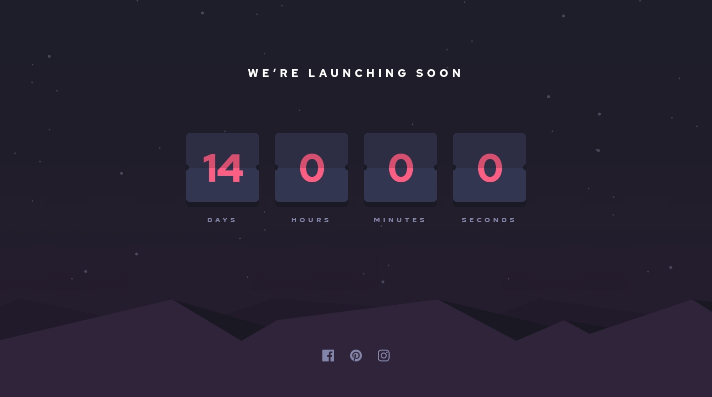
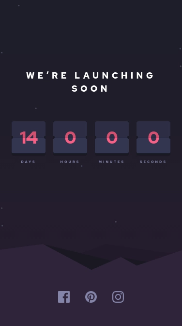

# Frontend Mentor | Launch countdown timer
This is my solution to the [Launch countdown timer challenge](https://www.frontendmentor.io/challenges/launch-countdown-timer-N0XkGfyz-) from [Frontend Mentor](https://www.frontendmentor.io/).

## Tech Stack
 - Angular
 - SCSS

## Developer Tools
 - VS Code
 - Figma

## Links
 - [Website](https://fem-launch-countdown-timer-jgerard.vercel.app) hosted with [Vercel](https://vercel.com/)
 - [Solution](https://www.frontendmentor.io/solutions/launch-countdown-timer-vy4kZDzw1C)

## Screenshots
### Desktop

### Mobile

## About Frontend Mentor
[Frontend Mentor](https://www.frontendmentor.io/) challenges help you improve your coding skills by building realistic projects.

## Copyright
© 2023 Johnny Gérard
